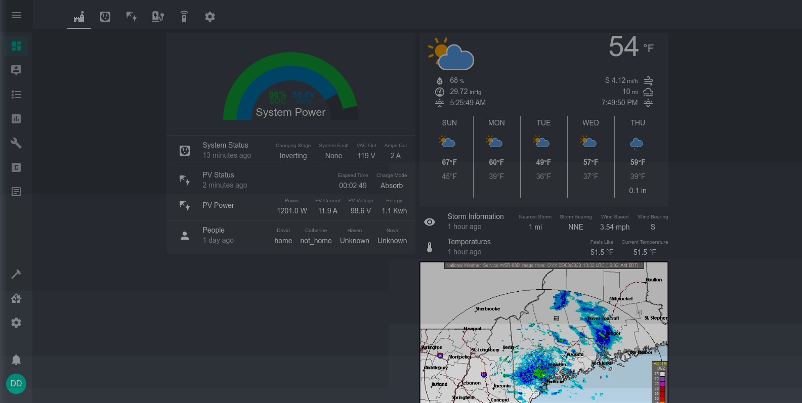
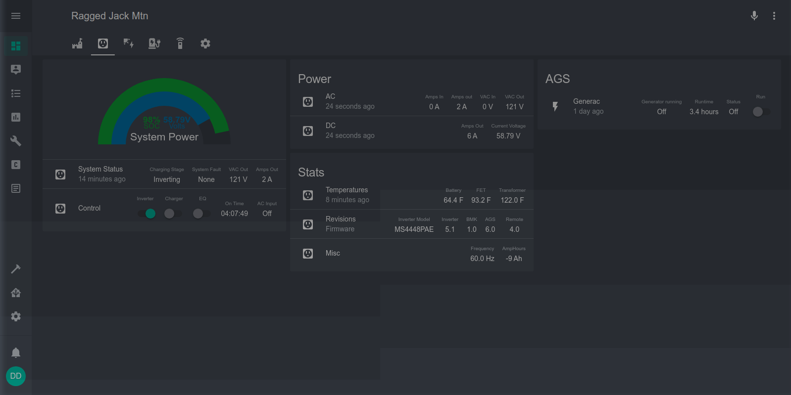
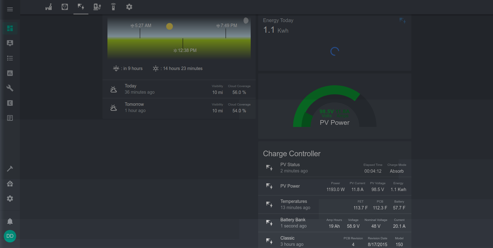
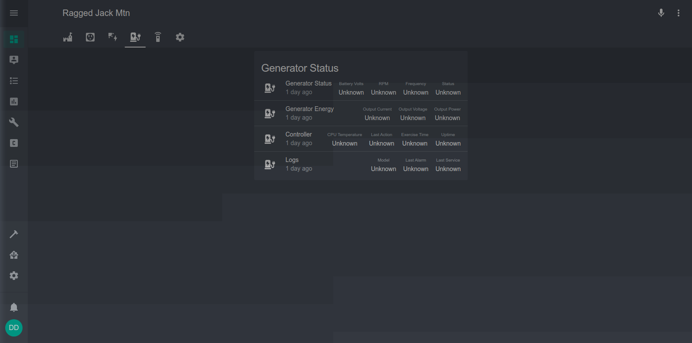
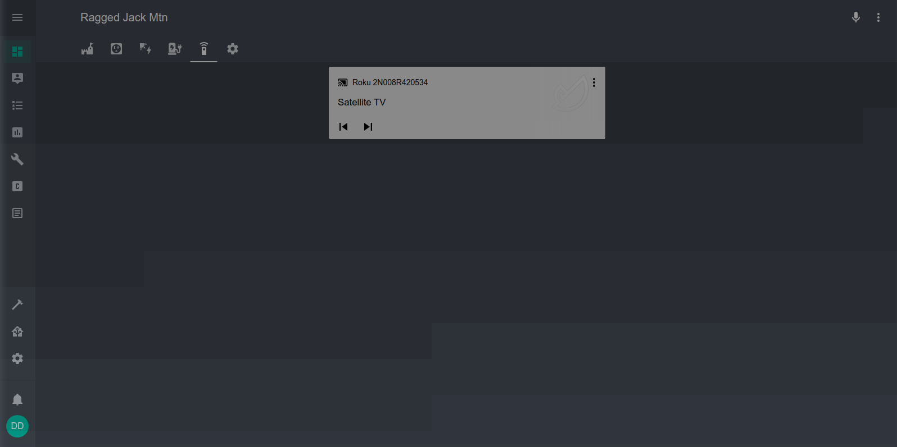
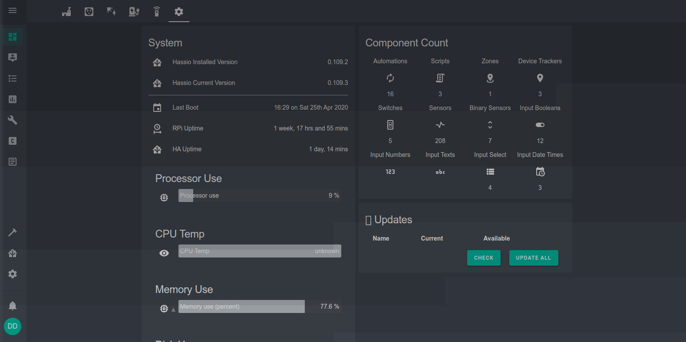

RaggedJackMtn.io
================
Home Assistant configuration for a home automation project monitoring an offgrid home.

### Screenshots

  
  
Home

  
  
Power Center

  
  
PV Array

  
  
Generator

  
  
Media

  
  
System Monitor

